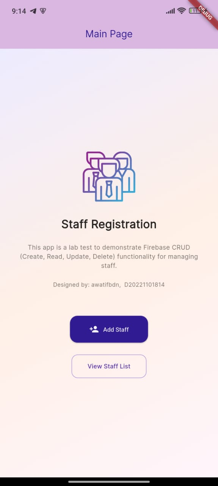
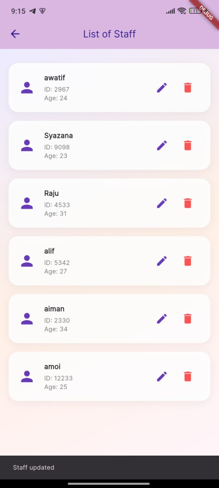
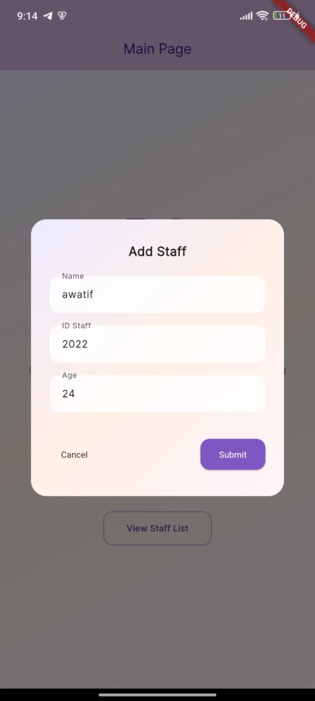
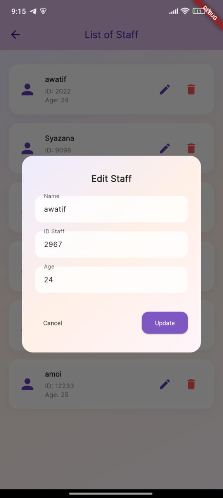
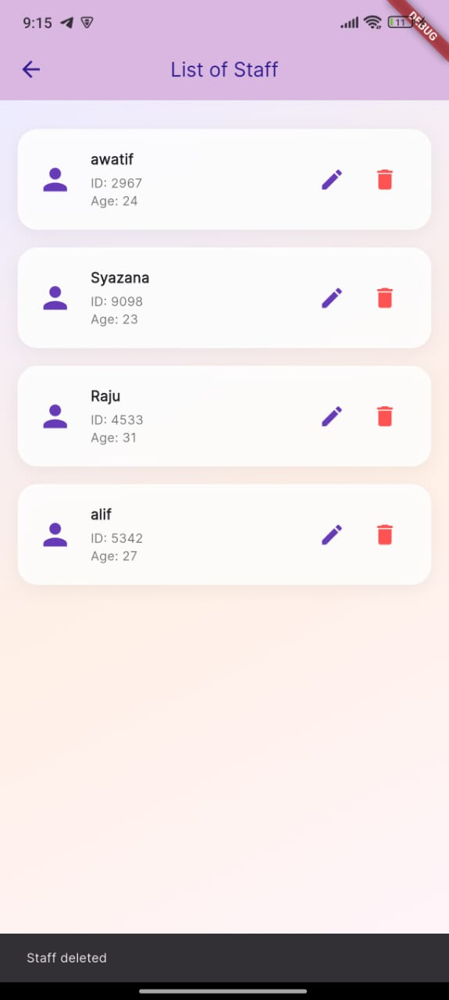

**LAB TITLE:** Building a CRUD Application Using Firebase (INDIVIDUAL)

---

## 👤 Student's Information

- **Name:** NURUL AWATIF BINTI ABIDIN
- **Matrix Number:** D20221101814
- **Group:** B

---

## 🚀 Project Overview

This Flutter mobile application demonstrates basic CRUD operations integrated with Firebase Firestore. Users can create, read, update, and delete staff information in real time.

---

## ✨ Features

- 🔄 Real-time data updates using Firestore
- ➕ Add, ✏️ Edit, 🗑️ Delete staff entries
- 🎨 Stylish UI with gradient background
- 🔥 Firebase backend integration

---

## 🖼️ Screenshots

### 🧑‍💼 Main Page

### 🧑‍💼 Staff List Page

### ➕ Add Staff Page

### ✏️ Edit Staff Page

### ✏️ Delete Staff Page

---

